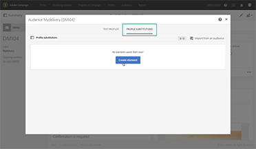
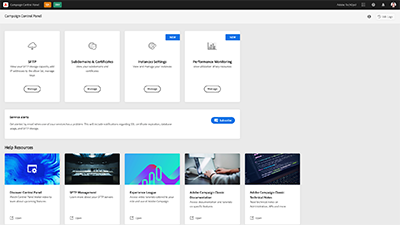

# Adobe Campaign Standard - overzicht

Adobe Campaign biedt een platform voor het ontwerpen van cross-channel klantervaringen en levert een omgeving voor visuele orkestratie van campagnes, realtime-interactiebeheer en uitvoering via meerdere kanalen. Deze gebruikershandleiding bevat video’s en tutorials over de vele functies en mogelijkheden van Adobe Campaign Standard.

## Nieuwe functies

* **[Maximaliseer het rendement op investering van uw e-mail en leer praktische tips voor hernieuwde betrokkenheid van leden](https://experienceleague.adobe.com/docs/campaign-learn/tutorials/strategy/campaign-maximize-email-best-practices.html?lang=nl)**

   *Leer hoe u rendement op investering van e-mail kunt maximaliseren en leer de aanbevolen methoden voor hernieuwde betrokkenheid lan keden. Ontdek de strategieën om uw betrokkenheid van leden te verbeteren en het algemene succes van uw e-mailcampagnes te begrijpen.*

* **[Problemen oplossen](https://experienceleague.adobe.com/docs/campaign-standard-learn/troubleshooting/overview.html?lang=nl)**

*Krijg hulp bij het oplossen van bekende problemen met Adobe Campaign Standard.*

## Aanbevolen door medewerkers van Adobe

<table>
<tr>
  <td>
    
    

      <a href="./communication-channels/email/profile-substitution.md">
    <strong>Profielsubstitutie - E-mailberichten testen aan de hand van doelprofielen (video)</strong>
    </a>
    

    

    <em>Leer hoe u een proef voor reviewen verzendt met de exacte weergave van het bericht dat het profiel ontvangt.</em>
    

  </td>
   <td>
    
    

    <a href="https://experienceleague.adobe.com/docs/campaign-standard-learn/control-panel/control-panel-overview.html?lang=nl">
    <strong>Configuratiescherm (video’s)</strong>
    </a>
    

    

    <em> Verhoog uw efficiëntie als beheerder door instellingen te beheren en het gebruik van uw instanties te volgen met het Configuratiescherm.</em>
    

  </td>
  <td>
    
    

      <a href="https://experienceleague.adobe.com/docs/campaign-standard-learn/getting-started-with-push-notifications-android/introduction.html?lang=nl">
    <strong>Tutorial: Aan de slag met pushmeldingen voor Android™</strong>
    </a>
    

    

    <em>Deze tutorial leidt u door de stappen die nodig zijn voor het verzenden van pushmeldingen vanuit Adobe Campaign en het ontvangen van deze meldingen in uw Android™-app. </em>
    

  </td>
</tr>
</table>

## Aanvullende bronnen

* [Documentatie](https://experienceleague.adobe.com/docs/campaign-standard/using/campaign-standard-home.html?lang=nl)
