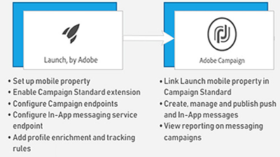

# Overzicht

De Campagne van Adobe verstrekt een platform voor het ontwerpen van dwars-kanaalklantenervaringen en verstrekt een milieu voor visuele campagneorchestratie, interactiebeheer in real time en kanaaluitvoering. Deze gebruikershandleiding bevat video&#39;s en zelfstudies over de vele functies en mogelijkheden van Adobe Campaign Standard.

## Nieuwe functies

* **[Externe API-activiteit](/help/managing-processes-and-data/data-management-activities/external-api-activity.md)**    
   *Leer hoe u een workflow configureert en uitvoert met de externe API-activiteit.*

* **[Profielvervanging - E-mailberichten testen met behulp van doelprofielen](/help/communication-channels/email/profile-substitution.md)**    
   *Leer hoe u een proefdruk ter controle verzendt met de exacte weergave van het bericht dat het profiel ontvangt.*

* **[Configuratiescherm - Google TXT-recordbeheer](/help/administrating/control-panel/google-txt-record-management.md)**    
   *Leer hoe u een Google TXT-site-verificatierecord toevoegt aan al uw subdomeinen die worden gebruikt om e-mails naar GMAIL-adressen te verzenden via het Configuratiescherm voor Campagne.*

* **[Zelfstudie: Aan de slag met pushmeldingen voor Android](https://docs.adobe.com/content/help/en/campaign-standard-learn/getting-started-with-push-notifications-android/introduction.html)**    
   *In deze zelfstudie worden de stappen besproken die nodig zijn voor het verzenden van pushmeldingen vanuit Adobe Campaign en het ontvangen van deze meldingen in uw Android-app.*

## Personeelspictogrammen

<table>
<tr>
  <td>
    
    

      <a href="./communication-channels/mobile/in-app/in-app-message-overview.md">
    <strong>In-app-berichten (zelfstudie)</strong>
    </a>
    

    

    <em>In-App Overseinen is een kanaal dat u toestaat om een bericht te tonen wanneer de gebruiker binnen een mobiele toepassing actief is.</em>
    

  </td>
   <td>
    
    

      <a href="./designing-content/email-designer/email-designer-overview.md">
    <strong>E-mailontwerper (video's)</strong>
    </a>
    

    

    <em>Met de e-mailontwerper kunt u snel en moeiteloos persoonlijke e-mails maken.</em>
    

  </td>
  <td>
    
    

      <a href="./designing-content/product-listings-in-transactional-email.md">
    <strong>Productaanbiedingen (zelfstudie)</strong>
    </a>
    

    

    <em>Transactiee-mails maken met een lijst met producten en aanbiedingen. </em>
    

  </td>
</tr>
</table>

## Aanvullende bronnen

* [Documentatie](https://docs.adobe.com/content/help/en/campaign-standard/using/campaign-standard-home.html)
